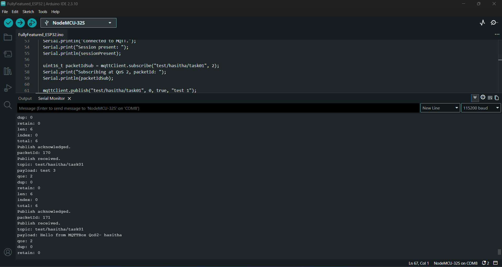
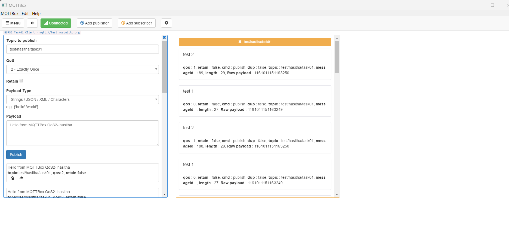
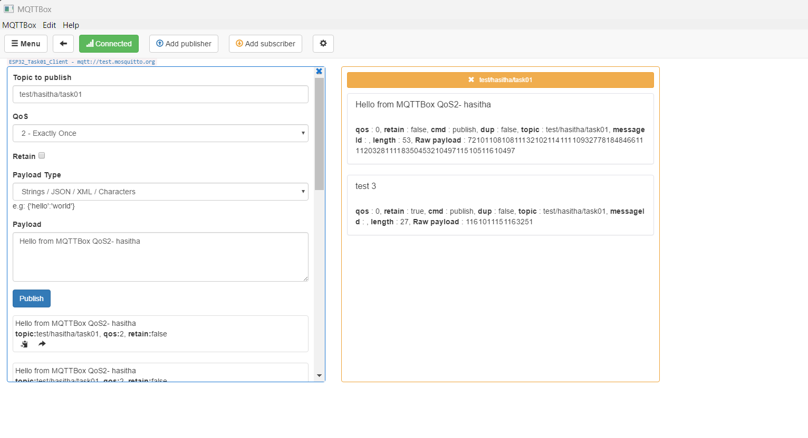
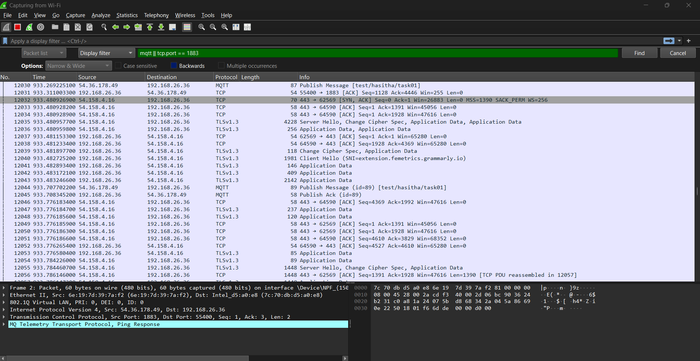
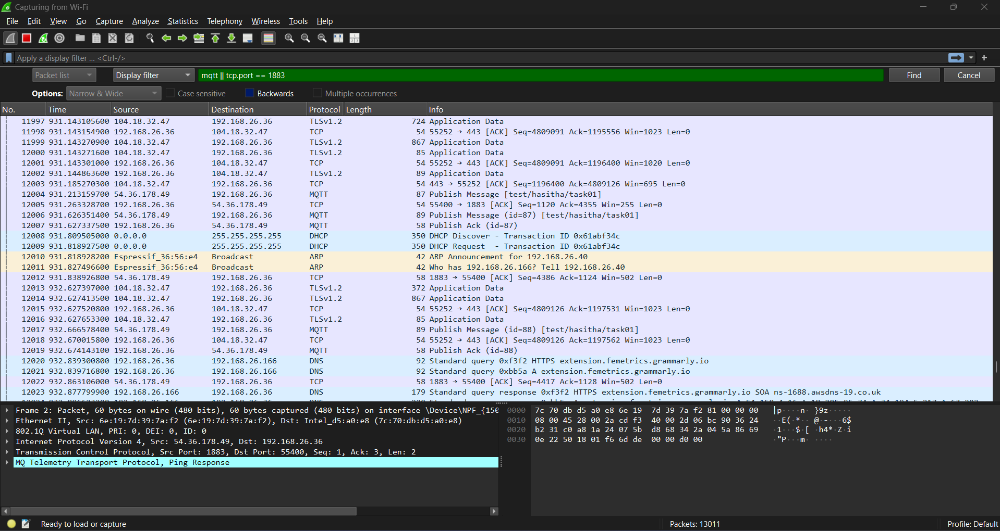

# Task 01: MQTT over Port 1883 (Unencrypted)

## Objective

Connect ESP32 to MQTT broker using unencrypted connection on port 1883.

## Concepts

- Basic MQTT connection
- Publish/Subscribe pattern
- No encryption or authentication
- Plain text communication

## Prerequisites

- MQTT broker running on port 1883
- ESP32 with WiFi connection
- PubSubClient library installed

## Configuration

### WiFi Settings
```cpp
const char* ssid = "YOUR_WIFI_SSID";
const char* password = "YOUR_WIFI_PASSWORD";
```

### MQTT Broker Settings
```cpp
const char* mqtt_server = "192.168.1.100"; // Broker IP
const int mqtt_port = 1883;
```

## Steps

1. Update WiFi credentials in the sketch
2. Update broker IP address
3. Upload sketch to ESP32
4. Open Serial Monitor (115200 baud)
5. Observe connection and messages

## Expected Output

```
Connecting to WiFi...
Connected to WiFi
IP address: 192.168.1.50
Connecting to MQTT broker...
Connected to MQTT broker
Publishing message: Hello from ESP32
Message published
```

## Testing with MQTTBox

1. Create connection to `localhost:1883`
2. Subscribe to topic `esp32/outgoing`
3. You should see messages from ESP32
4. Publish to topic `esp32/incoming`
5. ESP32 should receive and display message

## Wireshark Analysis

1. Start Wireshark capture
2. Filter: `tcp.port == 1883`
3. Observe:
   - CONNECT/CONNACK packets
   - PUBLISH packets (plain text)
   - SUBSCRIBE/SUBACK packets
4. Note: Messages are visible in plain text

## Security Notes

⚠️ **WARNING**: This connection is unencrypted. Anyone on the network can:
- Read all messages
- Modify messages
- Impersonate clients

**Never use unencrypted MQTT in production!**

## Next Steps

Proceed to Task 02 to add username/password authentication.

## Arduino Serial Output

ESP32 successfully connected to WiFi and MQTT broker, then published and subscribed to messages.



## MQTTBox Connection

MQTTBox was used to connect to the public MQTT broker and subscribe to the topic.



## MQTT Publish Test

Messages were published using MQTTBox with QoS levels 0, 1, and 2.



## Wireshark Filter

The following filter was used to capture MQTT traffic over port 1883.

```text
mqtt || tcp.port == 1883
```




## Wireshark Packet Analysis

The MQTT publish packet is visible in plaintext because port 1883 communication is not encrypted.

Highlighted packet:

- Publish Message
- Topic: test/hasitha/task01
- Payload: test 2

Since no TLS is used, packet payload can be directly inspected.



